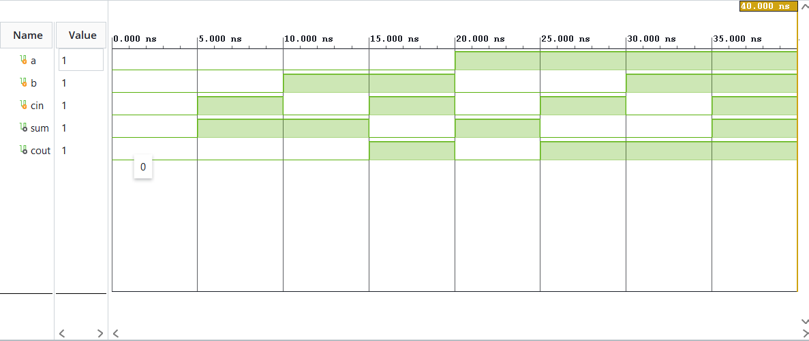
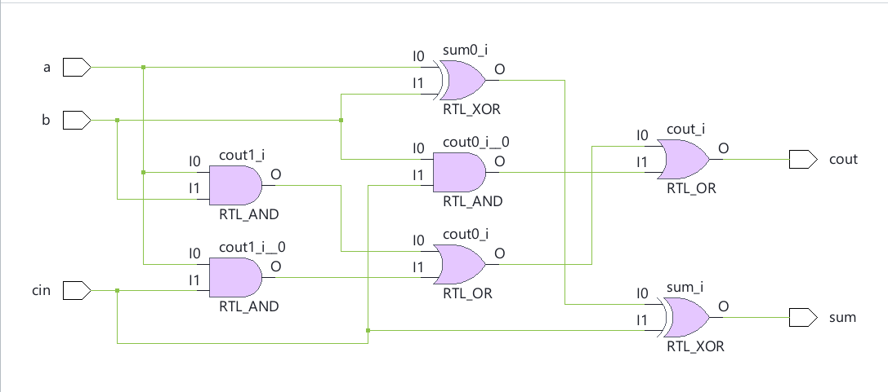

#Full Adder

A full adder is a combinational circuit which adds three binary bits resulting in a sum and a carry bit. The full adder is an extension to the functionality of a half adder, as in multi-bit binary addition, the carry element of each bit's addition must be transferred to the adjacent bit similar to decimal additions involving mutliple digits.

The following is the truth table of the full adder:

 |  a  |  b  | cin | sum | cout  |
 | :-: | :-: | :-: | :-: |  :-:  |
 |  0  |  0  |  0  |  0  |   0   |
 |  0  |  0  |  1  |  1  |   0   |
 |  0  |  1  |  0  |  1  |   0   |
 |  0  |  1  |  1  |  0  |   1   |
 |  1  |  0  |  0  |  1  |   0   |
 |  1  |  0  |  1  |  0  |   1   |
 |  1  |  1  |  0  |  0  |   1   |
 |  1  |  1  |  1  |  1  |   1   |

 Here, cin is the carry component formed as a result of the previous bit's addition (if any) and cout is carry generated in the addition of the current bits.

 Similar to a half adder, the sum component can be realised by taking the XOR of a, b and cin as an odd number of 1(s) results in 1 in sum and even number of 1s results in 0 in sum. As seen in the half adder, when both the inputs are one, the carry becomes one, likewise, in a full adder an even number of 1s or two 1s results in the carry becoming one. As any two of three inputs or all three inputs have a possibility of being 1s, we check for at least once occurence of two 1s.

 Thus, sum = a XOR b XOR cin    
 cout = (a AND b) OR (a AND cin) OR (b AND cin)

## Implementation
Implemented using dataflow modeling in Verilog. Simulated and verified in Xilinx Vivado.

## Simulation Waveform

## Schematic

## Files
- 'full_adder.v' - Module
- 'full_adder_tb.v' - Testbench