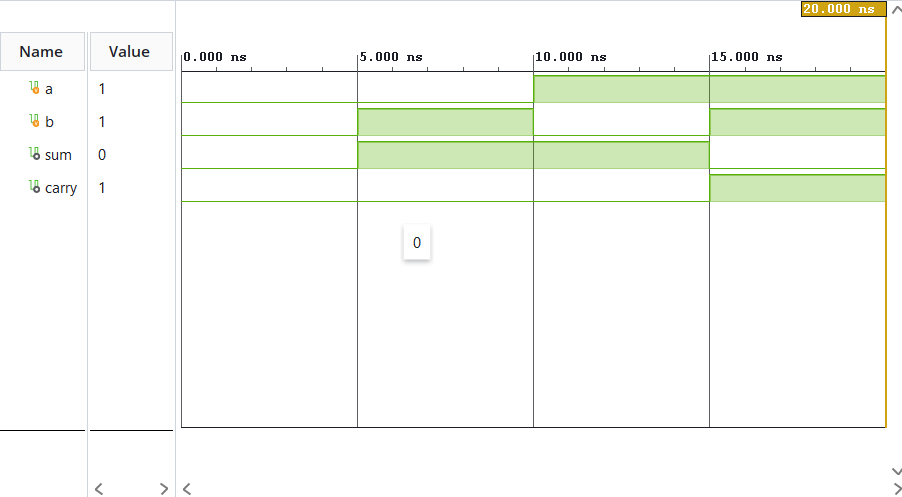
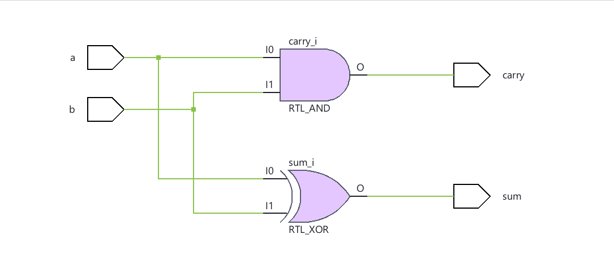

# combinational-circuits-verilog
#Half-Adder

A Half-Adder is a combinational circuit which adds two binary bits resulting in a sum and a carry bit.
This addition in binary can be realised from the following truth table:

Let us consider two binary inputs a,b and output bits sum and carry.

 |  a  |  b  | sum | carry |
 | :-: | :-: | :-: | :---: |
 |  0  |  0  |  0  |   0   |
 |  0  |  1  |  1  |   0   |
 |  1  |  0  |  1  |   0   |
 |  1  |  1  |  0  |   1   |

The sum component can be realized using the gate XOR (Exclusive OR) as observed from the above truth table an odd number of 1(s) results in 1 in sum and an even number of 1(s) results in 0 in sum. The operation of 1 + 1 results in two or in binary 10, meaning a carry can only be produced when both the inputs are 1s, which corresponds to the operation of the AND gate.

Thus, sum = a XOR b                                                                                                                                                
      carry = a AND b

## Implementation
Implemented using dataflow modeling in Verilog.                                                                                                        Simulated and verified in Xilinx Vivado.

## Simulation Waveform

## Schematic

## Files
- `half_adder.v` — Module
- `half_adder_tb.v` — Testbench
