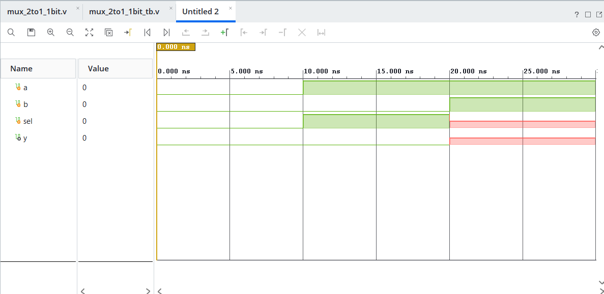
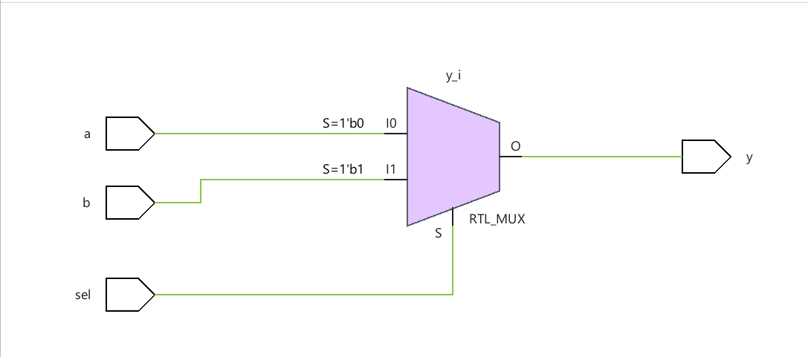

# 2-to-1 1 bit Multiplexer

A multiplexer is a type of combinational circuit which is used for the selectivity of the given inputs. The selection is based on another entity, 'sel' whose value varies and corresponds to the given inputs. In a 2 to 1 single bit multiplexer, based on the variable 'sel', one of the 2 single bit inputs (say a,b) get selected as seen in the below truth table.

| sel |  y  |
| :-: | :-: |
|  0  |  a  |
|  1  |  b  |

A multiplexer can be implemented in multiple ways, such as using a ternary operator, procedural blocks consisting of 'if' or 'case' conditions, etc. In this particular example, the multiplexer has been implemented using an always block consisting of a case condition.

## Implementation
Implemented using behavioural modeling in Verilog. Simulated and verified in Xilinx Vivado.

## Simulation Waveform

## Schematic

## Files
- 'mux_2to1_1bit.v' - Module
- 'mux_2to1_1bit_tb.v' - Testbench