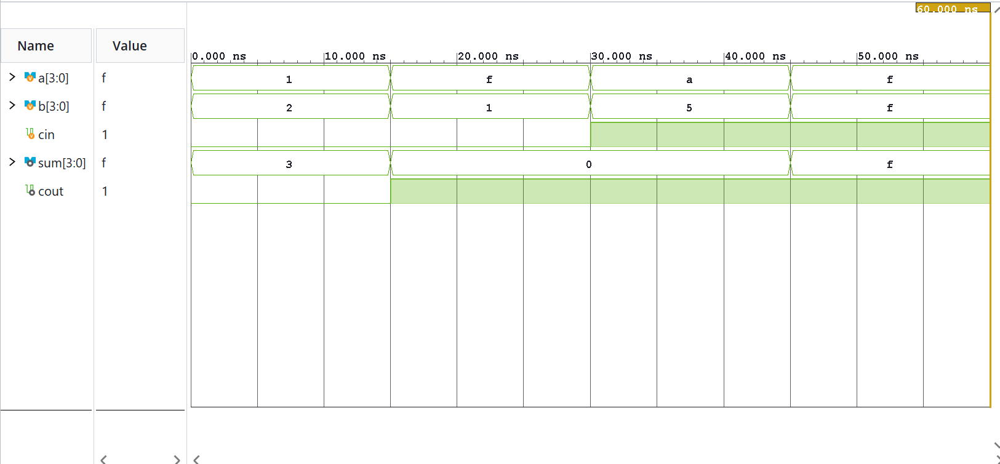
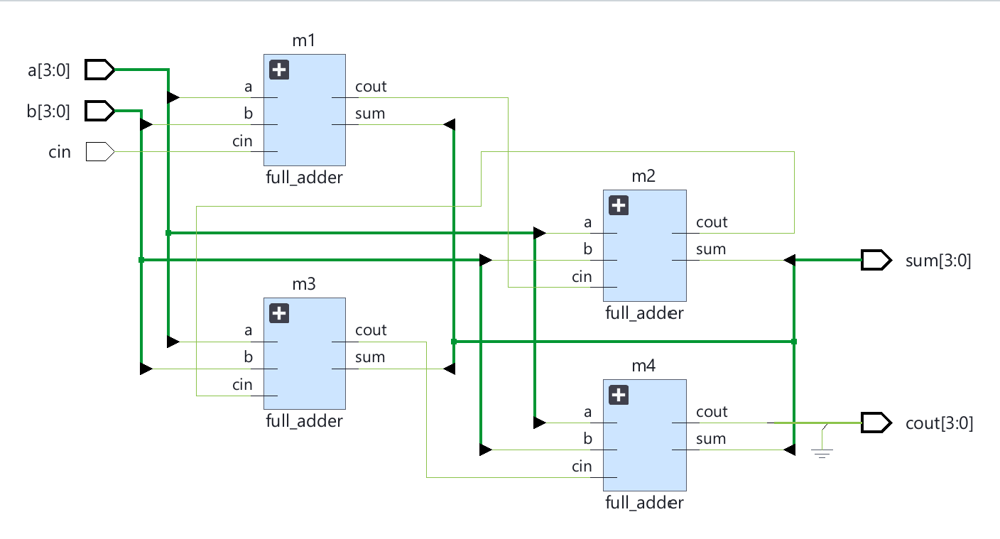

# 4-bit ripple carry adder

A four bit parallel adder or a 4-bit ripple carry adder is a combinational circuit which is implemented to add numbers or vectors consisting of 4 binary bits. 

Such a circuit can be realised by instantiating four full adder modules successively to add bits from both the input vectors or buses corresponding to the same index in each module instantiation. The carry obtained from one adder can be used as the input carry for the consecutive adder. 

The reason we call it a ripple carry adder is because like a ripple in water, each full adder (except the first one) must wait for the carry given by the previous module to execute its operation. This kind of implementation is not feasible when adding multiple bits as there is a delay in the operation from one adder to another, which is the reason why we use a carry select adder.

## Implementation
Implemented using structural modeling in Verilog. Simulated and verified in Xilinx Vivado.

## Simulation Waveform 

## Schematic 

## Files
- 'rpc_4bit.v' - Module
- 'rpc_4bit_tb.v' - Testbench
